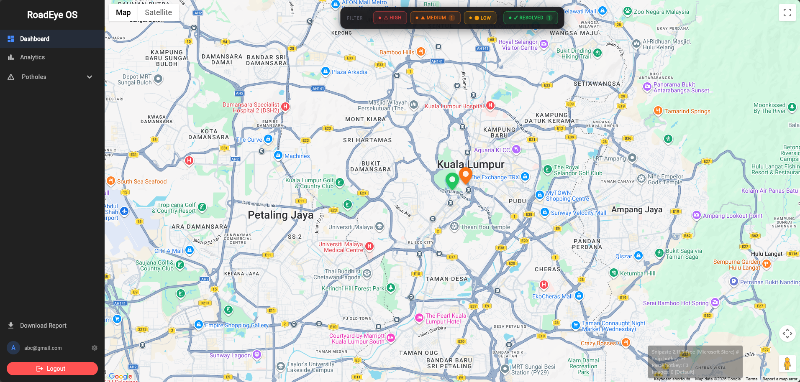
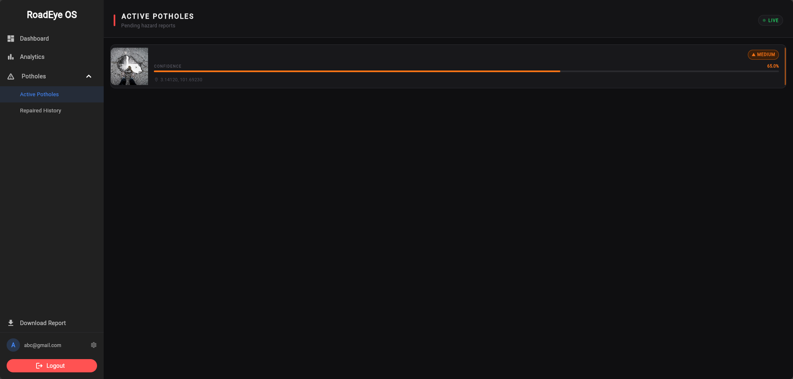
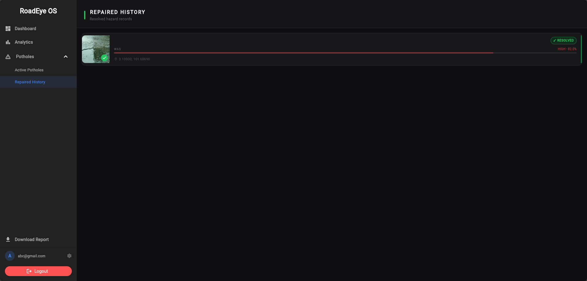
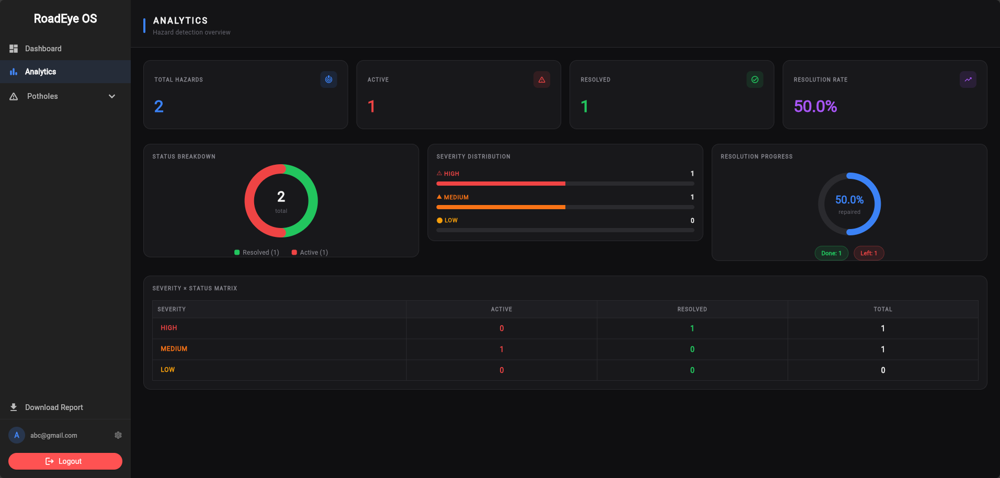
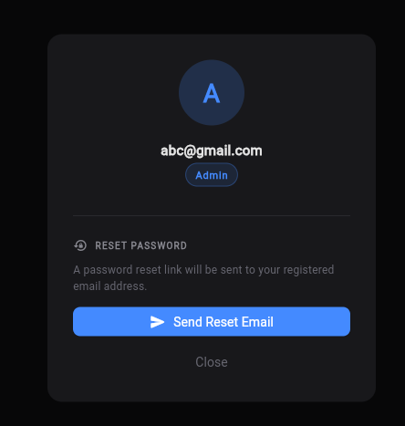
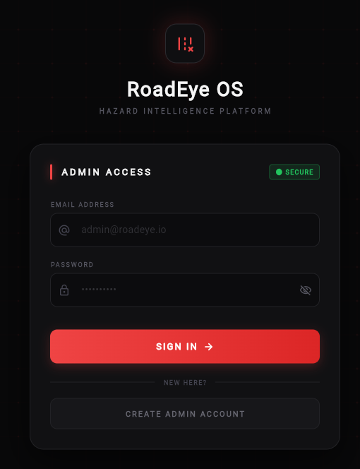
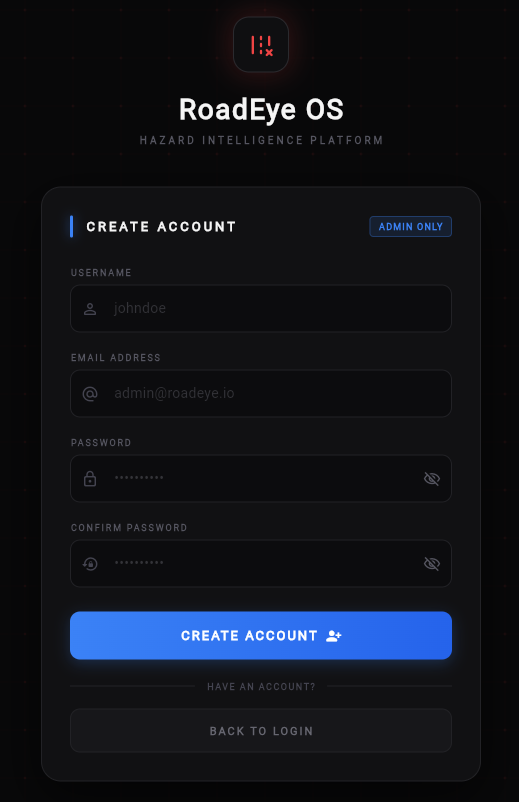

# 🚧 RoadEye OS — Hazard Intelligence Dashboard

> A real-time road hazard monitoring dashboard built with Flutter Web, Firebase, and Google Maps. Designed for road authorities and field operations teams to track, manage, and resolve potholes and road hazards.

---

## 📸 Overview



RoadEye OS is the web-based admin dashboard of the RoadEye platform. It listens to a live Firestore stream, plots detected hazards on an interactive map the moment they arrive, and gives admins the tools to manage, resolve, and report on road hazards — all in real time.

---

## ✨ Features

### 🗺️ Live Hazard Map

- Real-time Google Maps integration with custom SVG pin markers
- Markers colour-coded by severity — **HIGH** (red), **MEDIUM** (orange), **LOW** (amber), **RESOLVED** (green)
- Click any marker to view a popup with image, coordinates, severity badge, and a **Mark as Repaired** button
- Severity filter bar — toggle HIGH / MEDIUM / LOW / RESOLVED markers on/off with live counts

### 📋 Active Potholes List



- Paginated list of all unresolved hazards
- Sortable by confidence score and severity
- One-click resolve from the list view

### 🕓 Repaired History



- Full log of all resolved hazards with animated cards
- Shows original severity, confidence score, coordinates, and detection image

### 📊 Analytics Dashboard



- Live KPI cards — Total Hazards, Active, Resolved, Resolution Rate
- Donut chart — Status breakdown (Resolved vs Active)
- Severity distribution bar chart — HIGH / MEDIUM / LOW
- Circular resolution progress ring
- Severity × Status matrix cross-tab table

### 📥 CSV Export

- One-click download of the full hazards dataset
- Includes ID, detected by, coordinates, confidence %, severity, and status

### 👤 Profile & Account



- Profile modal showing logged-in admin email and role badge
- Password reset via Firebase Auth email link — sent directly from the dashboard

### 🔐 Authentication

| Login                              | Register                                 |
| ---------------------------------- | ---------------------------------------- |
|  |  |

- Firebase Auth email/password login and signup
- Admin-only account creation
- Secure logout with session clear

---

## 🛠️ Tech Stack

| Layer    | Technology                      |
| -------- | ------------------------------- |
| Frontend | Flutter Web                     |
| Database | Cloud Firestore                 |
| Auth     | Firebase Authentication         |
| Storage  | Firebase Storage                |
| Maps     | Google Maps JavaScript API      |
| Hosting  | Firebase Hosting*(recommended)* |

---

## 📁 Project Structure

```
lib/
├── main.dart               # App entry, Firebase init, map canvas registration
├── login_page.dart         # Animated login screen
├── signup_page.dart        # Admin account creation screen
├── dashboard_page.dart     # Root layout — sidebar + indexed page stack
├── sidebar.dart            # Navigation, profile, CSV export, logout
├── pothole_list_page.dart  # Active hazards list view
├── history_page.dart       # Resolved hazards history
└── analytics_page.dart     # Charts and KPI analytics
```

---

## 🚀 Getting Started

### Prerequisites

- [Flutter SDK](https://flutter.dev/docs/get-started/install) `>=3.0.0`
- A [Firebase project](https://console.firebase.google.com/) with the following enabled:
  - Authentication (Email/Password)
  - Cloud Firestore
  - Firebase Storage
- A [Google Maps API key](https://developers.google.com/maps/documentation/javascript/get-api-key) with the **Maps JavaScript API** enabled

### 1. Clone the repository

```bash
git clone https://github.com/your-username/roadeye-dashboard.git
cd roadeye-dashboard
```

### 2. Install dependencies

```bash
flutter pub get
```

### 3. Configure Firebase

Replace the placeholder values in `lib/firebase_options.dart` and `lib/main.dart` with your own Firebase project credentials:

```dart
await Firebase.initializeApp(
  options: const FirebaseOptions(
    apiKey: "YOUR_API_KEY",
    authDomain: "YOUR_PROJECT.firebaseapp.com",
    projectId: "YOUR_PROJECT_ID",
    storageBucket: "YOUR_PROJECT.appspot.com",
    messagingSenderId: "YOUR_SENDER_ID",
    appId: "YOUR_APP_ID",
  ),
);
```

### 4. Add your Google Maps API key

In `web/index.html`, add the Maps JavaScript API script tag inside `<head>`:

```html
<script
  src="https://maps.googleapis.com/maps/api/js?key=YOUR_GOOGLE_MAPS_API_KEY">
</script>
```

### 5. Run the app

```bash
flutter run -d chrome
```

---

## 🗄️ Firestore Data Structure

The dashboard reads from a single collection: `hazards_raw`

### Document schema

| Field          | Type       | Description                                 |
| -------------- | ---------- | ------------------------------------------- |
| `lat`        | `number` | Latitude of detected hazard                 |
| `lng`        | `number` | Longitude of detected hazard                |
| `confidence` | `number` | AI confidence score `0.0 – 1.0`          |
| `imageUrl`   | `string` | Firebase Storage URL of the detection image |
| `detectedBy` | `string` | Label or type of hazard detected            |
| `status`     | `string` | `PENDING` or `RESOLVED`                 |
| `timestamp`  | `number` | Unix timestamp (ms) of detection            |

### Severity mapping

| Confidence Score | Severity  |
| ---------------- | --------- |
| `≥ 0.8`       | 🔴 HIGH   |
| `≥ 0.5`       | 🟠 MEDIUM |
| `< 0.5`        | 🟡 LOW    |

### Example document

```json
{
  "lat": 3.139,
  "lng": 101.6869,
  "confidence": 0.82,
  "imageUrl": "https://firebasestorage.googleapis.com/...",
  "detectedBy": "POTHOLE",
  "status": "PENDING",
  "timestamp": 1706000000000
}
```

---
